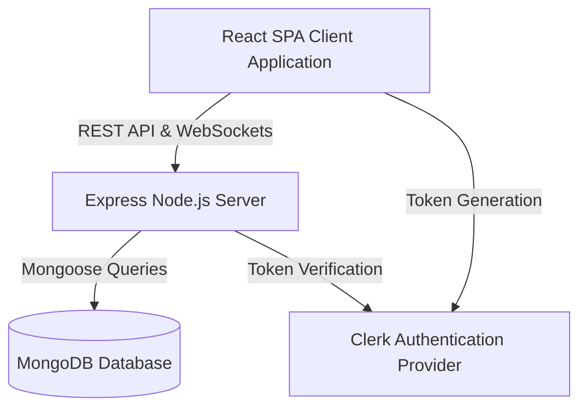

# CampusKart 🛒🎓

CampusKart is a modern, real-time marketplace exclusively designed for college students. It provides a secure platform to buy and sell items like textbooks, electronics, cycles, and hostel essentials within the campus community. 

## ✨ Features

- **Secure Authentication:** Powered by **Clerk**, ensuring only verified students (e.g., specific college email domains) can access the marketplace.
- **Real-Time Chat:** Integrated **Socket.io** allows buyers and sellers to communicate instantly without leaving the app.
- **Product Management:** Users can seamlessly list items for sale, upload images, and mark items as "Sold". Images are optimized and stored securely on **Cloudinary**.
- **Wishlist functionality:** Save favorite items to purchase later.
- **User Profiles:** A dedicated profile dashboard to track active listings, sold items, and wishlisted products.
- **Modern UI/UX:** Built with **Tailwind CSS** and **Framer Motion** for a responsive, highly animated, and premium feel.

## 🛠️ Technology Stack

**Frontend:**
- React (Vite)
- Redux Toolkit (State Management)
- Tailwind CSS (Styling)
- Framer Motion (Animations)
- React Router (Routing)

**Backend:**
- Node.js & Express
- MongoDB & Mongoose (Database)
- Socket.io (Real-time WebSockets)
- Clerk (Authentication Middleware)
- Cloudinary (Image Hosting)

---

## 🏛️ System Architecture

The platform utilizes a decoupled client-server architecture. The frontend is built with React (Vite) and handles all user interactions and real-time updates. The backend is an Express server responsible for secure API routing, database transactions, and authentication validation.



## 📂 Repository Structure

```text
CampusKart/
├── backend/                # Node.js & Express server
│   ├── models/             # Mongoose database schemas
│   ├── routes/             # API route definitions
│   ├── controllers/        # Request handling logic
│   ├── middleware/         # Custom Express middleware (auth, etc.)
│   ├── server.js           # Application entry point
│   └── package.json        # Backend dependencies and scripts
├── frontend/               # React & Vite application
│   ├── src/
│   │   ├── components/     # Reusable UI components
│   │   ├── pages/          # Application routes/pages
│   │   ├── store/          # Redux state slices
│   │   ├── App.jsx         # Main React component
│   │   └── main.jsx        # Entry point for React
│   ├── index.html          # HTML template
│   ├── vite.config.js      # Vite configuration
│   └── package.json        # Frontend dependencies and scripts
└── README.md               # Project overview and setup instructions
```

---

## 🚀 Local Development Setup

To run this project locally on your machine, follow these steps:

### 1. Prerequisites
Make sure you have [Node.js](https://nodejs.org/) and [Git](https://git-scm.com/) installed on your machine. You will also need accounts for **MongoDB Atlas**, **Clerk**, and **Cloudinary**.

### 2. Clone the Repository
```bash
git clone https://github.com/your-username/CampusKart.git
cd CampusKart
```

### 3. Backend Setup
```bash
cd backend
npm install
```
Create a `.env` file in the `backend` directory and add the following variables:
```env
PORT=5000
NODE_ENV=development
MONGO_URI=your_mongodb_connection_string
CLERK_PUBLISHABLE_KEY=your_clerk_publishable_key
CLERK_SECRET_KEY=your_clerk_secret_key
CLOUDINARY_CLOUD_NAME=your_cloudinary_cloud_name
CLOUDINARY_API_KEY=your_cloudinary_api_key
CLOUDINARY_API_SECRET=your_cloudinary_api_secret
FRONTEND_URL=http://localhost:5173
```
Run the backend server:
```bash
npm run dev
```

### 4. Frontend Setup
Open a new terminal window:
```bash
cd frontend
npm install
```
Create a `.env` file in the `frontend` directory and add the following variables:
```env
VITE_CLERK_PUBLISHABLE_KEY=your_clerk_publishable_key
VITE_API_URL=http://localhost:5000/api/v1
```
Run the frontend development server:
```bash
npm run dev
```

Your app will be running at `http://localhost:5173`.

---

## 🌍 Production Deployment

This project is configured to be easily deployed to **Vercel** (Frontend) and **Render** (Backend).

### Backend (Render)
1. Create a new Web Service on Render and connect your GitHub repository.
2. Set the Root Directory to `backend`.
3. Build Command: `npm install`
4. Start Command: `npm start`
5. Add all the environment variables from your local `.env` (excluding `FRONTEND_URL` for now).
6. Set `NODE_ENV` to `production`.
7. Deploy.

### Frontend (Vercel)
1. Import your GitHub repository to Vercel.
2. Set the Root Directory to `frontend`.
3. Add your `VITE_CLERK_PUBLISHABLE_KEY` (use Development keys for easier Vercel proxying, or Production keys with a custom domain).
4. Add `VITE_API_URL` pointing to your deployed Render URL (e.g., `https://campuscart-backend.onrender.com/api/v1`).
5. Deploy.

### Final Connections
- Once Vercel deploys, copy your live frontend URL.
- Go back to Render, add the `FRONTEND_URL` environment variable, and paste your Vercel URL.
- In your Clerk dashboard, ensure your live domain is configured (or stick to Development mode for hobby deployments).

---

**Note:** For detailed information regarding environment variables and specific configurations, please refer to the `README.md` files located in the `frontend` and `backend` directories respectively.
